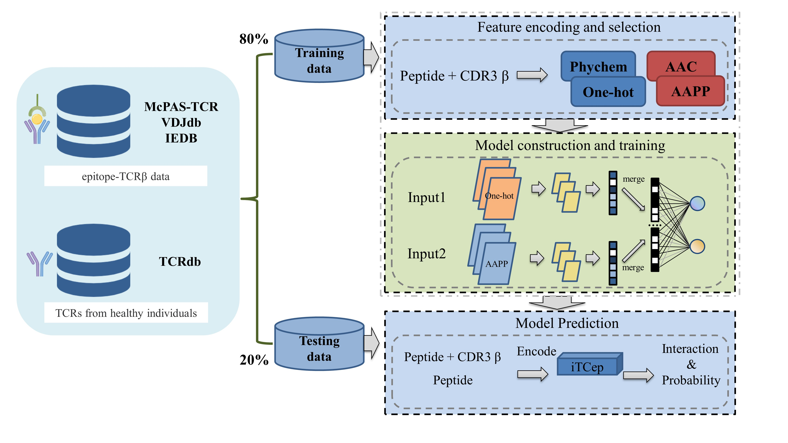

# iTCep: a deep learning framework for identification of T cell epitopes by harnessing fusion features.


## 1. Overview
The identification of cytotoxic T cell epitopes, as a foundation for developing targeted vaccines, 
is increasingly essential for tumor immunotherapy research. Here, we proposed a deep learning model 
named iTCep for predicting the interaction between peptides presented by major histocompatibility 
complex (MHC) class I molecules and TCRs based on the fusion features. The high predictive performance 
provides strong evidence that the iTCep is a reliable and robust method for identifying immunogenic 
peptides recognized by TCRs.
The iTCep webserver provides two predicting functionalities, one to predict the interaction between
the given multiple peptide-TCR pairs and the other to obtain the TCRs that could recognize the input 
peptides in accord with ranked predictive values.

The workflow of iTCep:

## 2. Installation
Download iTCep by
```
git clone https://github.com/kbvstmd/iTCep/
```
The codes depend on the following packages, please install them before getting started.
```
pip install numpy==1.19.5
pip install pandas==0.25.3
pip install biopython==1.76
pip install tensorflow==2.4.0
pip install xrld==1.2.0
``` 
The build will likely fail if it can't find them. For more information, see:

## 3. Usage
### 3.1 Data Format
Below is an example input data to show the required format:

| peptide     | CDR3             |
| :---:       | :---:            |
| RAKFKQLL    | CSVGGVSSGVYNEQF  |
| VYAWNRKRI   | CSAKGMMNTEAFF    |
| CRVLCCYVL   | CASSDSTGVNEQFF   |
| NLNCCSVPV   | CASSLGGASGSLSNEQFF |
| ELAGIGILTV  | CASSYSATGGEQYF   |
| WMRLLPLL    | CASRDQTGGEQFF    |
### 3.2 Parameters
- `input`: This parameter specifies the input files for the T-cell epitope prediction. ".csv" and ".xlsx" type of file are both supported. 
- `mode`: This parameter specifies the prediction mode, i.e., whether to predict pairs of T-cell epitopes and their corresponding TCRs ("pairs" / "peponly"). Default parameter value is "pairs".
- `dup`: This parameter specifies whether to remove duplicates from the prediction results ("True"/"False"). Default parameter value is "True".
- `outpt`: This parameter specifies the output file name or directory for the prediction results. In general, the file format is commonly '.csv'.
### 3.2 peptide-TCR pairs prediction:
Please refer to document `Example_file.xlsx` in `test` directory for the format of the input file. Column names are not allowed to change.
Run the following codes to perform the prediction.
```
python predict.py --input /path/to/input_file --output /path/to/output_file
# eg:
python predict.py --input test/ExampleFile.xlsx --output results/pairs_pred_output.csv
```
**notes:** 
The prediction results obtained using the above example command will be saved in the `results/pairs_pred_output.csv` file.

### 3.3 peptide only prediction:
Please refer to document `Example_file_pep.xlsx` in `test` directory for the format of the input file. Column names are not allowed to change.
Run the following codes to perform the prediction.
```
python predict.py --input /path/to/input_file --mode peponly --output /path/to/output_file
# eg:
python predict.py --input test/ExampleFile_pep.xlsx --mode peponly --output results/peptides_pred_output.csv
```
**notes:** 
The prediction results obtained using the above example command will be saved in the `results/peptides_pred_output.csv` file.
## 4. Citation
When using our results or modelling approach in a publication, please cite our paper:  
[https://www.frontiersin.org/articles/10.3389/fgene.2023.1141535/](https://www.frontiersin.org/articles/10.3389/fgene.2023.1141535/full)